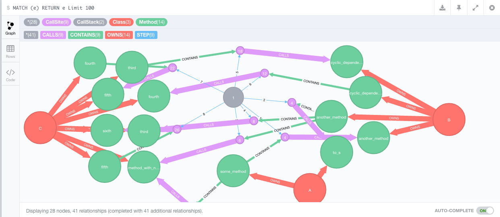
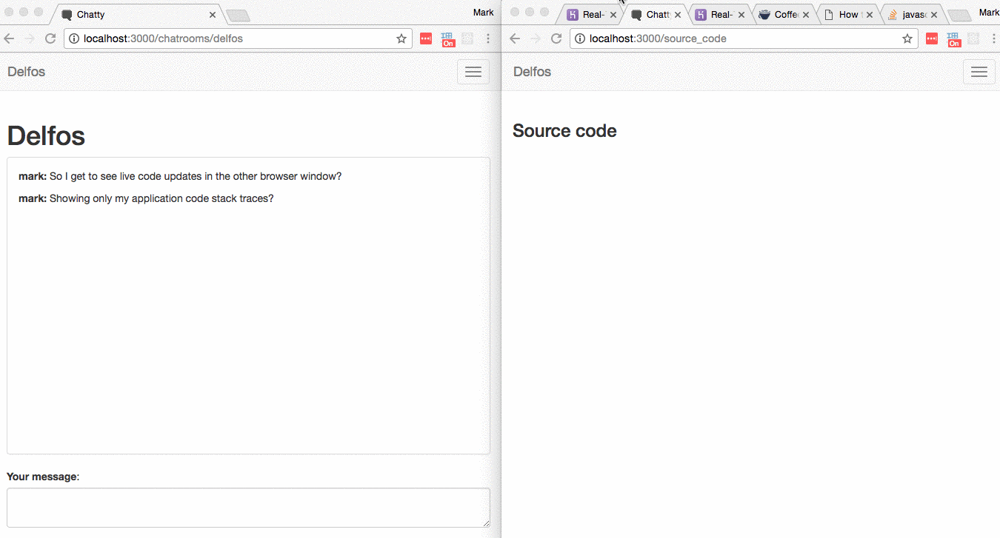

# Delfos

[](https://circleci.com/gh/ruby-analysis/delfos)
[](https://gemnasium.com/ruby-analysis/delfos)
[](https://codeclimate.com/github/ruby-analysis/delfos)
[](https://www.codacy.com/app/markthedeveloper/delfos?utm_source=github.com&amp;utm_medium=referral&amp;utm_content=ruby-analysis/delfos&amp;utm_campaign=Badge_Grade)
[](https://rubygems.org/gems/delfos)

# Background
For more on the background behind this project see [SOLID](solid.md) or [This talk](http://slides.com/markburns-1/fitting-code-on-screen)

# Functionality
  * Record runtime type information and call site file locations in every method call of your application for most ruby programs
  * Ignores library code - i.e. only records method calls defined in your application
  * [Not yet] Analysis of type information in Neo4j to:
    * show cyclic dependencies
    * highlight dependency issues across large file system distances
    * suggest potential domain concept file system organisations to simplify app structure

## Example output to neo4j

For the code in files [fixtures/a.rb](fixtures/a.rb) and [fixtures/b.rb](fixtures/b.rb).



## Neo4j example recorded data model

```cypher
(:CallStack{uuid: "111298a0-2d9c-468f-8e2c-1816a8c01899"})
  - [:STEP{number: 1}] ->
  (cs:CallSite{file: "file.rb", line_number: 1})

(cs) <- [:CONTAINS] - (m:Method{type:"InstanceMethod"})

(:Class{name: "A"}) - [:CONTAINS] -> (m)


(cs)-[:CALLS]
    -> (m2:Method)

    <-[:OWNS]-(:Class{name:"B"})
```

## Example usage with custom logger
See https://github.com/ruby-analysis/delfos-custom-call-site-logger-example



## Dependencies
Only one gem dependency on `binding_of_caller`

Delfos by default depends upon an _optional_ connection to a Neo4j instance for recording data.

## Usage

```ruby
#Gemfile
# Until this gem is a little more stable, then github master will be the best
# place to install from.
gem 'delfos', :git => 'https://github.com/ruby-analysis/delfos.git'


#e.g.  in config/initializers/delfos.rb or equivalent

# Delfos affects performance, so we recommend only setting up when required
if defined?(Delfos) && ENV["DELFOS_ENABLED"]
  Delfos.setup!
end

# Any code defined in the app or lib directories executed after this point will
# automatically have call stacks with type information recorded.

# You could now click around the app or run integration tests to record type
# and callsite information

# When you are finished call from e.g. a console
# This flushes neo4j queries, updates the distance metrics
# and disables Delfos

Delfos.finish!
```

recording test runs with rspec

``` ruby
RSpec.configure do |c|
  c.before(:suite) do
    require "delfos"

    your_library_path = File.expand_path("../../lib", __FILE__)
    Delfos.setup! application_directories: your_library_path
  end

  c.after(:suite) do
    Delfos.finish!
  end
end
```

#### Delfos.setup! options


* `application_directories` An array of application directories. Defaults to `app` and `lib`
* `logger` For outputing debug information during method recording.
* `call_site_logger` Defaults to recording to neo4j.
* `batch_size` Default batch size for neo4j querie
* `max_query_size` Max string length for neo4j queries before flushing
* `offline_query_saving` sets the offline query output file path or defaults to `delfos_cypher_output.cypher`  if `true`

### call_site_logger
You can supply an object for the `call_site_logger` that responds to `#log`

`#log` receives the following arguments : `(call_site, stack_uuid, stack_step)`

Where:
  * `call_site` has the following methods:
    * `container_method`, `called_method`, `file`, `line_number`
  * `stack_uuid` is a unique identifier for the current call stack
  * `stack_step` is the index of this call_site within the current call stack
  * `container_method` & `called_method` have the following methods defined:
    * `file`
    * `line_number`
    * `object` - self at that point during runtime
    * `class_method` - boolean

# Offline mode

By default delfos tries to push queries in batches to neo4j during runtime.
This tends to work fine for small projects and for manually interacting with an application,
but starts to fallover when running against a whole test suite.
Whilst, you can tweak the batch size and experiment with `sleep`ing in between specs, it is 
probably preferable to save the queries offline for later processing.

```ruby
config.before(:suite) do
  Delfos.setup! offline_query_saving: true
endt

```

Then you can run the command line binary to import the data. E.g.

```bash
NEO4J_PORT=8001 NEO4J_HOST=localhost delfos_import
```

This splits the data into files of 10,000 queries each, in `./tmp/delfos`
then executes them synchronously against neo4j.
Any queries that generate exceptions are logged in their corresponding error file.

E.g.

```bash
cat tmp/delfos/delfos_queries_ab.errors
```

```json
{"step_number":1,"stack_uuid":"80dfd309-eb42-4ceb-aa85-8c3d6d137954","call_site_file":"spec/bundler/plugin/api/source_spec.rb","call_site_line_number":78,"container_method_klass_name":"RSpec::ExampleGroups::BundlerPluginAPISource::ToLock::WithAdditionalOptionsToLock","container_method_type":"InstanceMethod","container_method_name":"(main)","container_method_file":null,"container_method_line_number":-1,"called_method_klass_name":null,"called_method_type":"InstanceMethod","called_method_name":"to_lock","called_method_file":"lib/bundler/plugin/api/source.rb","called_method_line_number":254}
```

In general these error files probably represent bugs in Delfos so feel free to raise an issue with
replication steps.

If the errors are obvious (e.g. an incorrectly determined method name), you could edit them and re-import with

```
cp ./tmp/delfos/delfos_queries_ab.errors fixed_query_parameters

NEO4J_PORT=8001 NEO4J_HOST=localhost delfos_import fixed_query_parameters
```


# File system distance

Delfos also records the distance across the file system.  The distance is
defined as basically the visual distance in an ordinary filesystem tree view
like vim's NERDTree view.

The file system distance is updated as a separate task after all `(CallSite)`
nodes have been added to the graph. This can be done by calling
`Delfos::Neo4j.update_distance!`.

You may do this in an after suite hook like this:

```
config.after(:suite) do
  Delfos.finish!
end
```

The scoring algorithm asserts that files that traverse a large number of
directories to call other files end up with a 'worse' score than files which
call files which are alphabetically next to each other in the same directory.

There is also a score recorded for number of possible files traversed. So
projects which have large numbers of files per directory are also penalised.

This scoring system is quite likely to change as it is used against more
systems to record sample data sets.


## Examples

Snapshot of the delfos codebase:

```
▾ lib/
  ▾ delfos/
    ▸ distance/
    ▾ method_logging/
        args.rb
        args_spec.rb
        code_location.rb
        code_location_spec.rb
        klass_determination.rb
    ▾ neo4j/
        distance_update.rb
        distance_update_spec.rb
        execution_persistence.rb
        informer.rb
        informer_spec.rb
        query_execution.rb
    ▸ patching/
      common_path.rb
      common_path_spec.rb
      execution_chain.rb
      execution_chain_spec.rb
      integration_spec.rb
      method_logging.rb
      method_logging_spec.rb
      patching.rb
      patching_spec.rb
      patching_unstubbing_spec_helper.rb
      perform_patching.rb
      perform_patching_spec.rb
      remove_patching.rb
      version.rb
    delfos.rb
    delfos_spec.rb
```

In the example above, if a call site in `remove_patching.rb` were to call a
site in `common_path.rb` in the same directory it would receives 'penalty'
points for crossing the 11 files in between, but no penalty points for
traversing directories. It would also get penalty points for the 11 possible
file traversals in the directory.

If `code_location.rb` were to call neo4j `query_execution.rb` it would receive
 * penalty points for traversing `args.rb` and `args_spec.rb`
 * penalty points for the 4 possible file traversals in the directory

  Then it would receive
 * penalty points for moving up one directory,
 * and more penalty points for traversing into the `neo4j` directory
 * plus penalty points for possible traversals across the 4 directories

Finally it would receive
  * penalty points for traversing across the 6 files
  * penalty points for the 6 possible traversals

The ordinary points and points for possible traversals are recorded separately.
The algorithm is likely to change once analysis is done on the effectiveness of the data.

# Future work

Following are some ideas of where to take this project next:

## Analysis

### UI
I would like to create a UI for visualizing call stacks with their respective
file system traversals.

### Command line tool
I want to detect common software design mistakes in a way which is
useful/actionable like rubocop.


# Development

Delfos specs are organized in a similar fashion to `golang` tests and follow
the principles outlined by this README.  That is that code that changes
together lives together.

So there are no specs in the `spec` folder, unit specs live next to their implementation.
E.g.

```
lib/delfos/neo4j/
  distance_update.rb
  distance_update_spec.rb
```

The rake task is setup to handle this default and is equivalent to the following:

```
NEO4J_HOST=http://localhost NEO4J_PORT=7476 NEO4J_USERNAME=username NEO4J_PASSWORD=password bundle exec rspec lib
```


